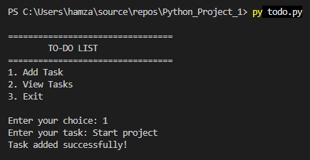
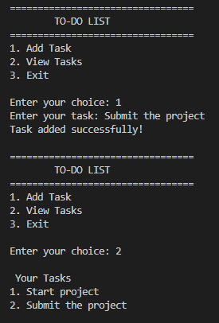
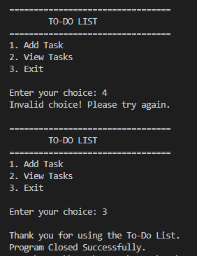

# DecodeLabs Project 1 - To-Do List

## Project Overview

This project was developed as part of the DecodeLabs Python Programming Internship.

## Features

- Add new tasks
- View all added tasks
- Simple command-line interface
- Exit the application

## Concepts Used

- Python Lists
- While Loop
- If-Else Statements
- User Input
- For Loop
- enumerate()

## Technologies

- Python 3
- Visual Studio Code

## Author

**Muhammad Hamza**
Software Engineering Student
Iqra University

GitHub: https://github.com/mhamza2004

## Output Screenshots

### Main Menu

### Adding Tasks

### Viewing Tasks

